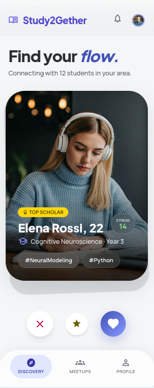
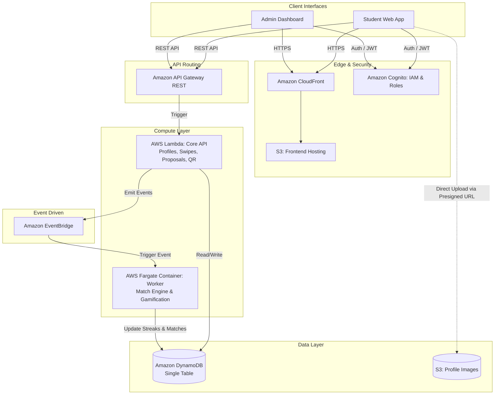

# Study2Gether

> **Never study alone. Find your focus, build your streak.**

Study2Gether is an app made for uni students who are tired of studying alone. We took that familiar left/right swiping mechanic you already know and applied it to finding the perfect study buddy.

Before you start swiping through profiles, you can set up exactly what kind of study vibe you're going for:
1. **Subject-Specific Mode:** Type in exactly what you're working on (like "Cloud Computing" or "Calculus") to link up with someone studying the exact same thing so you can figure it out together.
2. **Flex Mode:** Just pick "Nothing Specific" to match with someone doing totally different work. You just hang out (virtually or IRL) and keep each other accountable so nobody gets distracted by their phone.

Once you both swipe right on each other, it's a match! Using a time and place proposal form you can figure out when and where to study. To keep you motivated and actually hitting the books, we've got a built-in streak system. The more days a week you study, the higher your rank climbs (like hitting Silver, Gold, or Diamond).

  
   
  <em>Mockup</em>

## Core Features
* **Web-First Experience:** A fully responsive website accessible from any browser.
* **Account Creation:** Secure user sign-up and authentication via email.
* **Individual Profiles:** Users can set up their profiles with multiple pictures, a personal bio, and selectable subjects they are interested in.
* **Dual Study Modes:** The ability to toggle between "Subject-Specific Mode" (finding someone studying the exact same topic) and "Flex Mode" (matching with anyone).
* **Discovery & Swiping:** An intuitive, card-based feed where users can swipe left to pass or right to connect with potential study partners.
* **Meetup Proposal System:** Matches coordinate using a streamlined scheduling tool. One user proposes a time and a campus location, and the other userer can accepts, declines, or proposes an alternative. Once accepted, the session is officially scheduled.
* **QR Code Meetup Verification:** To ensure sessions actually happen and streaks remain legit, the site generates a unique QR code when you meet up. Your buddy scans it to verify the session, track the time, and securely update your ranks.
* **Gamified Streaks & Rankings:** A dynamic tracking system that rewards consistent study habits. Meeting up regularly builds your streak and promotes you through visual ranks (e.g., Silver, Gold, Diamond).
* **Admin Dashboard:** A separate, restricted interface for platform administrators to manage users, review flagged profiles, and oversee the platform's general activity.

### Architecture Diagram

## Project Structure & Modules

This repository is organized into three main sub-projects. Please refer to their specific READMEs for detailed technical documentation.

| Module | Technology | Description | Documentation |
| :--- | :--- | :--- | :--- |
| **study2gether-core** | AWS Lambda, API Gateway, DynamoDB, Cognito, EventBridge | The serverless backend infrastructure. It handles REST APIs, WebSocket connections, swiping/matching logic, and database operations. | [View README](https://github.com/Study2Gether/study2gether-core/blob/master/README.md) |
| **study2gether-web-client** | React, Amazon S3, Amazon CloudFront | The user-facing web application where students can set their study modes, swipe on profiles, and chat in real-time. | [View README](https://github.com/Study2Gether/study2gether-web-client/blob/master/README.md) |
| **study2gether-web-admin** | React, AWS | The administrative dashboard used for platform management, monitoring user data, and system moderation. | [View README](https://github.com/Study2Gether/study2gether-web-admin/blob/master/README.md) |

### Credits
**University:** Hochschule Heilbronn (HHN) 
**Course:** Cloud Computing SS26 
**Team:**
* [NDXIII](https://github.com/NDXIII)
* [Kartoffelbauer](https://github.com/Kartoffelbauer)
* [Gnas20](https://github.com/orgs/Study2Gether/people/gnas20)
* [Philipp-stack-code](https://github.com/orgs/Study2Gether/people/gnas20)
