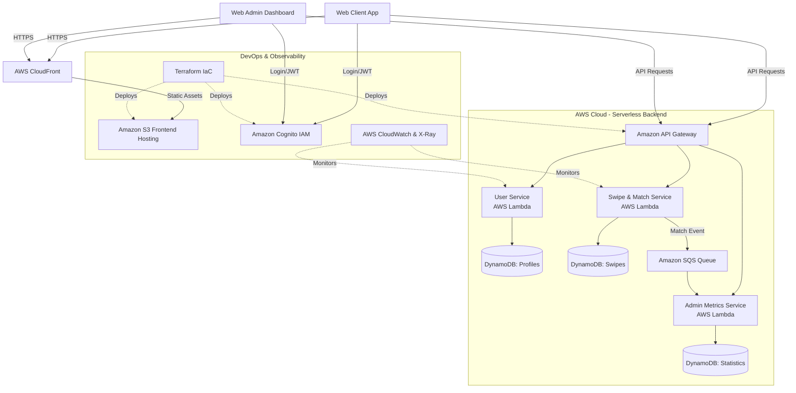

# 💘 CloudCrushHHN - Cloud Computing Competition (CCC’26)

**CloudCrushHHN** is the exclusive dating and networking app for students of Heilbronn University (HHN). Our goal: Bringing students together across different study programs, whether for a date in the campus cafeteria or a shared late-night study session in the LIV library.

This project was developed as part of the **Cloud Computing Competition (CCC’26)** and demonstrates a highly scalable, 100% serverless microservices architecture.

## 🏗 Architecture & Tech Stack

Our architecture follows the "Serverless First" principle to guarantee massive scalability and reduce idle costs to almost €0.00.

* **Frontend & UX:** React (Progressive Web App / Mobile-First)
* **Hosting:** AWS S3 + Amazon CloudFront (CDN)
* **Identity & Access Management (IAM):** Amazon Cognito (RBAC: User & Admin Roles)
* **API Routing:** Amazon API Gateway
* **Compute Services:**
  * User Service: AWS Lambda (Serverless)
  * Matching Service: AWS Lambda (Serverless for scalable swipe logic)
  * Notification/Metrics Service: AWS Lambda
* **Databases:** Amazon DynamoDB (NoSQL for millisecond latency)
* **Asynchronous Communication:** Amazon SQS (Decoupling of services)
* **Infrastructure as Code (IaC):** Terraform
* **Monitoring & Observability:** AWS CloudWatch & AWS X-Ray (Distributed Tracing)

### Architecture Diagram

# 📂 Repository Structure

To adhere to the Separation of Concerns principle and keep our deployments clean, the CloudCrushHHN ecosystem is divided into three distinct repositories:

* `cloudcrush-core`: The engine of the platform. This monorepo contains our complete Infrastructure as Code (Terraform) alongside the source code for all our AWS Lambda backend microservices.

* `cloudcrush-web-client`: The Mobile-First React Progressive Web App (PWA) that acts as the primary dating interface for the students.

* `cloudcrush-web-admin`: The internal React dashboard for administrators to monitor platform metrics, secured via Cognito admin roles.