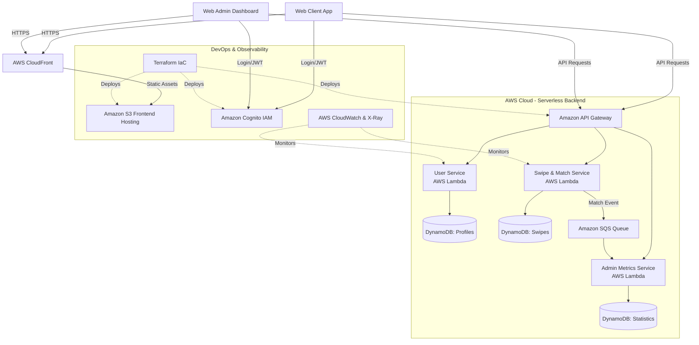

# CloudCrushHHN - Dating App for Heilbronn University 💘

**CloudCrushHHN** is the goto dating and networking app for students of Heilbronn University (HHN).
**Our goal:** Bringing students together across different study programs, whether for a date in the campus cafeteria or a shared late-night study session in the LIV library.

This project is being developed as part of the **Cloud Computing Competition (CCC’26)** and demonstrates a highly scalable, 100% serverless microservices architecture.

## ✨ Core Features (MVP Scope)

**For Students (Web Client)**
* **Student Profiles:** Clean profile creation including a display name, a short bio, and multiple profile pictures.
* **HHN Compatibility (The Local Edge):** Profiles include campus-specific icebreakers. Students select their ultimate Mensa Food (e.g., "Vegan Power Bowl" or "Currywurst Fanatic") and their favorite Campus Spot (e.g., LIV Library, Neckarbogen). Shared preferences are highlighted to make the first real-life meetup frictionless!
* **The Swipe Engine:** The core discovery mechanic, swipe right to connect, swipe left to pass.
* **Match Notifications:** Instant event-driven notification when a mutual "Right Swipe" occurs.

**For Administrators (Web Admin)**
* **Live Metrics:** Real-time tracking of total registered users, active swipes, successful match counts, and trending campus spots.
* **System Observability:** A secure dashboard to monitor platform usage and distributed system health.

---

## 🏗️ Architecture & Tech Stack

Our architecture follows the "Serverless First" principle to guarantee massive scalability and reduce idle costs to almost €0.00.

* **Frontend & UX:** React (Progressive Web App / Mobile-First)
* **Hosting:** AWS S3 + Amazon CloudFront (CDN)
* **Identity & Access Management (IAM):** Amazon Cognito (RBAC: User & Admin Roles)
* **API Routing:** Amazon API Gateway
* **Compute Services:**
  * User Service: AWS Lambda (Serverless)
  * Matching Service: AWS Lambda (Serverless for scalable swipe logic)
  * Notification/Metrics Service: AWS Lambda
* **Databases:** Amazon DynamoDB (NoSQL for millisecond latency)
* **Asynchronous Communication:** Amazon SQS (Decoupling of services)
* **Infrastructure as Code (IaC):** Terraform
* **Monitoring & Observability:** AWS CloudWatch & AWS X-Ray (Distributed Tracing)

### Architecture Diagram

## 📂 Repository Structure & Modules

The CloudCrushHHN ecosystem is organized into three main repositories to ensure a clean separation of concerns. Please refer to their specific READMEs for detailed technical documentation and local setup instructions.

| Repository | Technology | Description | Documentation |
| :--- | :--- | :--- | :--- |
| **`cloudcrush-core`** | Terraform / AWS Lambda | The engine of the platform. This monorepo contains the complete Infrastructure as Code (IaC) alongside the source code for all backend microservices. | [View README](https://github.com/CloudCrushHHN/cloudcrush-core/blob/main/README.md) |
| **`cloudcrush-web-client`** | React / PWA | The student-facing frontend. A Mobile-First Progressive Web App (PWA) that acts as the primary dating and swiping interface. | [View README](https://github.com/CloudCrushHHN/cloudcrush-web-client/blob/main/README.md) |
| **`cloudcrush-web-admin`** | React | The internal administration frontend. A dashboard for admins to monitor platform metrics and health, secured via Cognito. | [View README](https://github.com/CloudCrushHHN/cloudcrush-web-admin/blob/main/README.md) |
